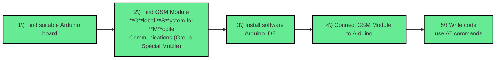

## **Basics of Building of SMS and Arduino Apps**

## SMS App

```mermaid
  graph LR
  A["1\) Find an App Developer<br>e.g. React Native, Flutter"]
  style A fill:#67ea94,stroke:#000000,stroke-width:2px
  B["2\) Install software<br>e.g. Node.js"]
  style B fill:#67ea94,stroke:#000000,stroke-width:2px
  C["3\) Design simple UI for easy usage"]
  style C fill:#67ea94,stroke:#000000,stroke-width:2px
  D["4\) Integrate SMS Functionality"]
  style D fill:#67ea94,stroke:#000000,stroke-width:2px
  E["5\) Set up Message Processing"]
  style E fill:#67ea94,stroke:#000000,stroke-width:2px
  F["6\) Test/Publish App"]
  style F fill:#67ea94,stroke:#000000,stroke-width:2px

  A-->B
  B-->C
  C-->D
  D-->E
  E-->F
```
## Arduino App

```mermaid
  graph LR
  A["1\) Find suitable Arduino board"]
  style A fill:#67ea94,stroke:#000000,stroke-width:2px
  B["2\) Find GSM Module<br> **G**lobal **S**ystem for **M**obile<br>Communications (Group Spécial Mobile)"]
  style B fill:#67ea94,stroke:#000000,stroke-width:2px
  C["3\) Install software <br> Arduino IDE"]
  style C fill:#67ea94,stroke:#000000,stroke-width:2px
  D["4\) Connect GSM Module to Arduino"]
  style D fill:#67ea94,stroke:#000000,stroke-width:2px
  E["5\) Write code <br> use AT commands"]
  style E fill:#67ea94,stroke:#000000,stroke-width:2px

  A-->B
  B-->C
  C-->D
  D-->E

```
