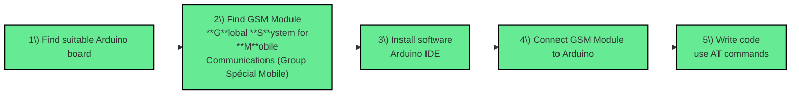

## **Basics of Building of SMS and Arduino Apps**

## SMS App

```mermaid
  graph LR
  A["1\) Find an App Developer<br>e.g. React Native, Flutter"]
  style A fill:#67ea94,stroke:#000000,stroke-width:2px
  B["2\) Install software<br>e.g. Node.js"]
  style B fill:#67ea94,stroke:#000000,stroke-width:2px
  C["3\) Design simple UI for easy usage"]
  style C fill:#67ea94,stroke:#000000,stroke-width:2px
  D["4\) Integrate SMS Functionality"]
  style D fill:#67ea94,stroke:#000000,stroke-width:2px
  E["5\) Set up Message Processing"]
  style E fill:#67ea94,stroke:#000000,stroke-width:2px
  F["6\) Test/Publish App"]
  style F fill:#67ea94,stroke:#000000,stroke-width:2px

  A-->B
  B-->C
  C-->D
  D-->E
  E-->F
```

Creating an SMS app requires an app developer, and since our objective is something that can be accessible to everyone, we can use platforms like React Native and Flutter which can run on both IOS and Android phones. Next we have to install the necessary software for the platform, like Node.js or React Native, to execute code. Then we design the UI for the app, or how it will look for the user, including a page for the chat channels and the threads in each individual chat. After that we implement the different components necessary for an SMS app through code, like sending and receiving messages and accessing SMS features specifically. And finally, we can test and publish the app.

## Arduino App

