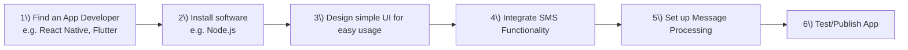

## **Basics of Building of SMS and Arduino Apps**

```mermaid
  graph LR
  A["1\) Find an App Developer<br>e.g. React Native, Flutter"]
  --> B["2\) Install software<br>e.g. Node.js"]
  B-->C["3\) Design simple UI for easy usage"]
  C-->D["4\) Integrate SMS Functionality"]
  D-->E["5\) Set up Message Processing"]
  E-->F["6\) Test/Publish App"]
```
