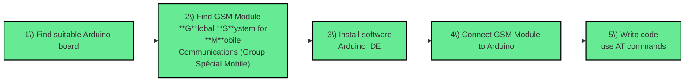

## **Basics of Building of SMS and Arduino Apps**

## SMS App

```mermaid
  graph LR
  A["1\) Find an App Developer<br>e.g. React Native, Flutter"]
  style A fill:#67ea94,stroke:#000000,stroke-width:2px
  B["2\) Install software<br>e.g. Node.js"]
  style B fill:#67ea94,stroke:#000000,stroke-width:2px
  C["3\) Design simple UI for easy usage"]
  style C fill:#67ea94,stroke:#000000,stroke-width:2px
  D["4\) Integrate SMS Functionality"]
  style D fill:#67ea94,stroke:#000000,stroke-width:2px
  E["5\) Set up Message Processing"]
  style E fill:#67ea94,stroke:#000000,stroke-width:2px
  F["6\) Test/Publish App"]
  style F fill:#67ea94,stroke:#000000,stroke-width:2px

  A-->B
  B-->C
  C-->D
  D-->E
  E-->F
```

Creating any app requires an app developer, and since our objective here is an SMS app that can be accessible to everyone, we can use platforms like React Native or Flutter which can run on both IOS and Android phones. Next we have to install the necessary software for the platform, like Node.js or React Native, to execute code. Then we design the UI for the app, or how it will look for the user, including a page for the chat channels and the threads in each individual chat. After that we implement the different components necessary for an SMS app through code, like sending and receiving messages and accessing SMS features specifically. And finally, we can test and publish the app.

## Arduino App

There are different types of Arduino boards to pick from to create a communication Arduino app; considering the input and output pins on the board, an Arduino MKR GSM 1400 would be a good fit for the following steps. We would then need a GSM module, which is a small device that accepts a phone SIM card and allows the phone to connect to a communication system. When a message is sent, the arduino sends commands to the GSM, which then sends an SMS to the phone specified. Then we install the software, like for the SMS app, and in this case it would be the arduino IDE . After that, we connect the GSM module to the Arduino through pins. And finally, we write the code for the Arduino app, in which we can use AT commands for network connection.

## Key Components of A Messaging App
1) **Authorization -** Give users a personal account, whether it be using a phone number, email, or an app specific user and password login.
2) **Access to Contacts -** Include a feature where users are able to give access to their existing contacts app to transfer that information rather than manually creating new contacts for the new app.
3) **Sharing Location -** Make sure that the user is able to share their location easily, as this is important for emergency situations.
4) **Error-Handling -** The app should be able to handle invalid inputs, failed messages and network issues, and notify the user when this occurs.
5) **SMS Character Limits -** Set character limits for the size of a message to reduce the likelihood of time delays or other errors for message sending.
6) **Time Stamping -** Display time-stamping as this is important in emergency situations.
